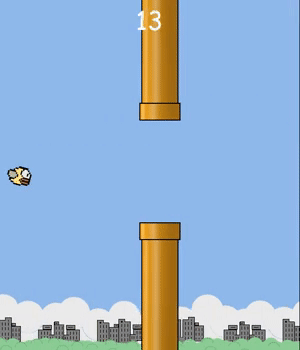
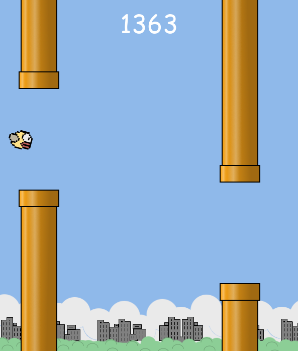

# AI Flappybird game

# Overview
This program impliments a similar creation of the game, flappybird. There are 3 options to run: Play the game yourself, Train the AI, and Play the resulting AI. 

# Methodology
This AI program impliments the NEAT algorithm to play a re-created version of flappybird using Pygame. Using python's NEAT library, we are able to give the AI network 3 inputs: bottom pipe height, top pipe height, and bird's y position. With this, the AI network uses (2) hidden nodes to do varying mathematical calculations to determine values of the output nodes. With each genome, this calculation changes in order to (hopefully) improve the output. Then these are piped to two output nodes, which represents 2 of the options: Jump, Not-Jump. The birds resulting action is determined by seeing which output node has the greatest value. To prevent gameplay from going forever with the AI, the maximum in-game score is 200. 

# Installation

This project requires [Python](https://www.python.org/downloads/) to run, and the following plugins:

- [Pygame](https://www.pygame.org/news)
- [NEAT](https://neat-python.readthedocs.io/en/latest/)

# Usage

## User play

Using the first option of gameplay, the user can play the recreated flappybird game themselves. Press spacebar to jump. 

## AI training 

Using the 2nd option of gameplay, we can train the AI using the NEAT python module. This will use the configuration located in the config.txt file, which has a population size of 50, and a fitness maximum of 200, which means that if the genome scores 200 in the game, it will be considered as trained. This was tested to complete in as low as 2 generations. 

## AI run

Using the 3rd option, it will use the resulting best data from the AI training (when successfully complete). This uses the configuration from best.pickle to impliment into the network. Then, the AI will play the game in real-time. With the score limit removed, the AI was able to achieve scores of over 2000 before manually stopped.

# Gameplay

| Gameplay GIF | Long AI run |
|---|---|
|||
